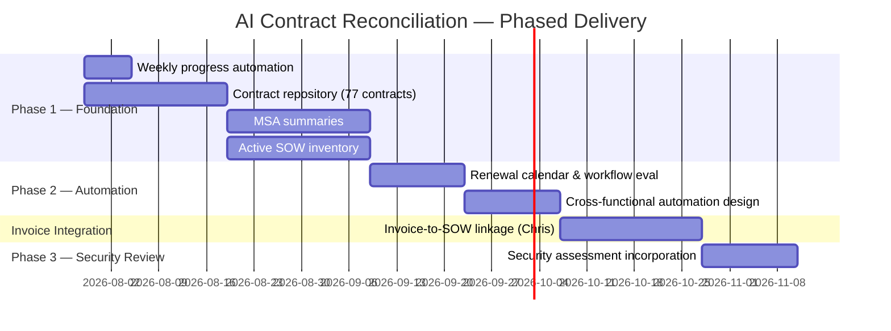

# AI Contract Reconciliation Initiative — Project Plan

**Project Lead:** Jason  
**Status:** Immediate focus (post sales leadership, territories, and compensation finalization)  
**Last Updated:** 2026-07-29

---

## Executive Summary

This initiative is more than a contract cleanup effort. It establishes a foundational capability for AI RevOps maturity and will become a strategic asset for **Sales, Finance, Legal, Customer Success, and Product**.

The end goal is an **AI-powered contract intelligence repository** — not simply a document library — that enables:

- Strategic account planning
- Renewal management
- Pricing governance
- Expansion identification
- Customer insights and forecasting
- Future AI automation

**Guiding principle:** AI accelerates the work; all outputs are **trust, but verify**. The objective is strategic account planning — not legal interpretation.

---

## Sequencing Overview

| Phase | Focus | Gate to Proceed |
|-------|-------|-----------------|
| **Phase 1** | Foundational data — repository, MSA summaries, SOW inventory | Clean, trusted, searchable dataset complete |
| **Phase 2** | AI-driven automation evaluation (renewals, notifications, orchestration) | Phase 1 complete; cross-functional teams engaged |
| **Invoice Integration** | Connect invoice details to active SOWs — contracted vs. deployed vs. billed (Chris) | Phase 2 automation scope defined |
| **Phase 3** | Incorporate last security review — assessment currency, risk visibility (Kenny & Tyler) | Invoice integration complete |

> **Important:** Cross-functional automation discussions begin **after** Phase 1 foundational work is complete — not before. Establish a clean, trusted data set first, then automate from there.

---

## Phase 1 — Foundational Contract Intelligence

### 1.1 Weekly Progress Reporting (Ongoing)

**Owner:** Jason (with AI automation)

Leverage AI to automate a weekly update to the project team and SLT. Each update must include:

| Section | Content |
|---------|---------|
| **Overall progress** | % complete against Phase 1 deliverables |
| **Key accomplishments** | What was completed since last update |
| **Risks, blockers, and decisions needed** | Items requiring leadership or cross-functional input |
| **Remaining work** | Open tasks with projected completion timeline |

**Deliverable:** Recurring weekly status report (automated draft + human review before send)

---

### 1.2 Contract Repository — 77 Contracts

**Scope:** Every customer, organized by parent organization

| Requirement | Detail |
|-------------|--------|
| Centralization | All executed agreements in a single repository |
| Storage & naming | Establish and document long-term storage location and naming convention |
| Searchability | Every document searchable and AI-ready |

**Deliverables:**
- [ ] Central contract repository populated with all 77 executed agreements
- [ ] Parent-organization hierarchy documented
- [ ] Storage location and naming convention documented (runbook)
- [ ] Documents indexed for search and AI ingestion
- [ ] Version control: current executed versions clearly distinguished from superseded documents

**Success criteria:** Any team member can locate any customer agreement by parent org, entity, or contract type within minutes.

---

### 1.3 MSA Summary — Per Customer

**Tooling:** Cursor / AI-assisted extraction with human verification

**Version control requirement:** AI must only read **current, executed versions** of MSAs — not documents passed during redlines, and not versions that have been replaced or updated. The repository must flag and exclude draft, redline, and superseded documents from AI ingestion.

Generate a standardized summary for each customer:

| Field | Purpose |
|-------|---------|
| MSA title | Identification |
| Parent organization and covered entities | Account hierarchy |
| MSA extends to child accounts/affiliates? | Expansion opportunity identification |
| Signature date | Contract timeline |
| Customer signer | Relationship context |
| Order of precedence | Conflict resolution across agreements |
| Contract term | Duration and obligations |
| Renewal date and renewal language | Renewal planning (including agreements that remain active while an SOW is active) |
| Notable commercial, legal, or operational provisions | Account strategy impact — including **restrictions such as logo usage** (AI can scan and flag these) |

**Deliverables:**
- [ ] Standardized MSA summary template
- [ ] Document version policy (executed vs. redline vs. superseded) documented and enforced
- [ ] MSA summary for each customer in the repository (current versions only)
- [ ] Flagged items requiring Legal or Finance review
- [ ] Logo usage and similar restrictions captured per account

**Success criteria:** Sales and CS can use MSA summaries for strategic account planning without opening source PDFs. No summaries derived from non-authoritative document versions.

---

### 1.4 Active SOW Inventory — Per Active SOW

For every active Statement of Work, capture:

| Field | Purpose |
|-------|---------|
| Product names / modules purchased | Entitlement clarity |
| Programs, workflows, and use cases deployed | Deployment vs. contract alignment |
| Scripts / campaign details (where applicable) | Operational context |
| Contracted volumes and utilization commitments | Usage governance |
| Contracted pricing | Pricing baseline |
| Referenced future pricing | Renewal / expansion forecasting |
| Go-live date | Timeline context |
| Termination-for-convenience provisions | Risk and renewal planning |
| Auto-renewal terms and notice requirements | Renewal calendar inputs |
| Non-standard amendments (email, side letters, etc.) | **Flag separately** — exceptions and commercial changes outside standard amendments |

**Deliverables:**
- [ ] Standardized SOW inventory template
- [ ] Active SOW record for each in-scope SOW
- [ ] Separate exception/amendment log for non-standard changes

**Success criteria:** Complete view of what is contracted and deployed for every active customer engagement.

---

## Phase 2 — AI-Driven Automation Evaluation

**Prerequisite:** Phase 1 complete (clean, trusted dataset)

**Owner:** Jason (with cross-functional teams brought in by leadership)

Once the initial repository and summaries are complete, evaluate where AI-driven automations add value:

| Automation Area | Description |
|-----------------|-------------|
| **Renewal management** | Rolling 12-month renewal calendar |
| **Notifications** | Proactive alerts for renewal windows, notice periods, and term expirations |
| **Workflow orchestration** | Cross-team handoffs for renewal prep, Legal review, and Finance alignment |

**Deliverables:**
- [ ] Automation opportunity assessment (prioritized)
- [ ] Rolling 12-month renewal calendar (initial version)
- [ ] Recommended automation roadmap with owners
- [ ] Cross-functional working session outcomes (Sales, Finance, Legal, CS, Product)

**Success criteria:** Leadership-approved automation roadmap with clear ROI and ownership.

---

## Invoice Integration — Contracted, Deployed, and Billed

**Owner:** Chris  
**Prerequisite:** Phase 2 automation scope defined

Connect the latest invoice details to each active SOW to achieve a complete view of:

| Dimension | Question Answered |
|-----------|-------------------|
| **Contracted** | What did the customer agree to? |
| **Deployed** | What is live in production? |
| **Billed** | What is currently being invoiced? |

**Deliverables:**
- [ ] Invoice-to-SOW mapping for all active accounts
- [ ] Discrepancy report (contracted vs. deployed vs. billed)
- [ ] Integrated account view in the contract intelligence repository

**Success criteria:** Single source of truth linking contract terms, deployment status, and billing for every active customer.

---

## Phase 3 — Security Review Incorporation

**Prerequisite:** Invoice integration complete  
**Stakeholders to inform:** Kenny and Tyler

Incorporate findings from the last security review into the contract intelligence repository. Dated or expired security assessments create measurable business risk:

| Risk Area | Impact |
|-----------|--------|
| **Open opportunities** | Security posture gaps can stall or derail active deals |
| **Revenue attainment** | Assessment currency affects close rates and expansion timing |
| **Customer churn** | Outdated assessments erode trust and increase retention risk |

**Deliverables:**
- [ ] Security assessment status linked to each customer account in the repository
- [ ] Assessment currency tracked (last review date, expiration, renewal due)
- [ ] Kenny and Tyler briefed on integration approach and ongoing visibility
- [ ] Alerts or flags for accounts with dated/expired security assessments
- [ ] Cross-reference between security status and renewal / expansion pipeline

**Success criteria:** Sales, CS, and Security have shared visibility into assessment currency alongside contract data — reducing surprise risk on open opportunities and renewals.

---

## Stakeholders & Roles

| Role | Name | Responsibility |
|------|------|----------------|
| **Project Lead** | Jason | Overall delivery, weekly reporting, Phase 1 & 2 |
| **Billing Integration** | Chris | Invoice-to-SOW linkage |
| **Security Review** | Kenny, Tyler | Phase 3 — security assessment incorporation and ongoing governance |
| **Executive Sponsor** | — | Priority setting, cross-functional escalation |
| **SLT** | — | Weekly progress visibility |
| **Sales, Finance, Legal, CS, Product** | — | Phase 2 cross-functional input; trust-but-verify on outputs |

---

## Risks & Mitigations

| Risk | Impact | Mitigation |
|------|--------|------------|
| Incomplete or missing contracts | Gaps in repository | Audit against CRM/account list; escalate missing docs to Legal |
| AI reads wrong document version (redlines, superseded) | Incorrect summaries | Enforce version policy; exclude non-executed docs from AI ingestion |
| AI extraction errors | Incorrect summaries | Trust-but-verify workflow; Legal/Finance review for flagged items |
| Non-standard amendments overlooked | Commercial surprises | Dedicated exception log; separate flagging in SOW inventory |
| Scope creep into automation before data is clean | Rework, low trust | Enforce Phase 1 gate before Phase 2 cross-functional sessions |
| Dated security assessments | Open opp risk, rev attainment impact, churn | Phase 3 integration; proactive alerts for expired assessments |
| Resource constraints on Jason | Timeline slip | AI acceleration for extraction; clear prioritization of 77 contracts |

---

## Key Decisions Needed

| Decision | Owner | Timing |
|----------|-------|--------|
| Long-term storage location and naming convention | Jason + IT/Legal | Phase 1 kickoff |
| Document version policy (executed vs. redline vs. superseded) | Jason + Legal | Phase 1 kickoff |
| MSA/SOW summary template approval | Jason + Legal | Before bulk extraction |
| Exception/amendment handling process | Jason + Legal | Phase 1 |
| Automation priority ranking | Leadership + Jason | Phase 2 kickoff |
| Invoice data source and mapping rules | Chris + Finance | Invoice integration kickoff |
| Security assessment data source and alert thresholds | Kenny + Tyler + Jason | Phase 3 kickoff |

---

## Definition of Done — Initiative Complete

The initiative is complete when:

1. All 77 contracts are centralized, searchable, and AI-ready (current executed versions only)
2. Every customer has a verified MSA summary — including logo usage and similar restrictions
3. Every active SOW has a complete inventory record with exceptions flagged
4. Weekly AI-assisted progress reporting is operational
5. A rolling 12-month renewal calendar and automation roadmap are approved
6. Invoice details are linked to active SOWs (contracted, deployed, billed view)
7. Security assessment currency is integrated and visible per account (Kenny & Tyler informed)
8. The repository functions as an **AI-powered contract intelligence platform** — not a passive document library

---

## Appendix — Document Templates (To Be Created)

- [ ] Contract naming convention runbook
- [ ] Document version control policy (executed vs. redline vs. superseded)
- [ ] MSA summary template
- [ ] Active SOW inventory template
- [ ] Non-standard amendment / exception log
- [ ] Weekly progress report template
- [ ] Renewal calendar template
- [ ] Security assessment status tracker
