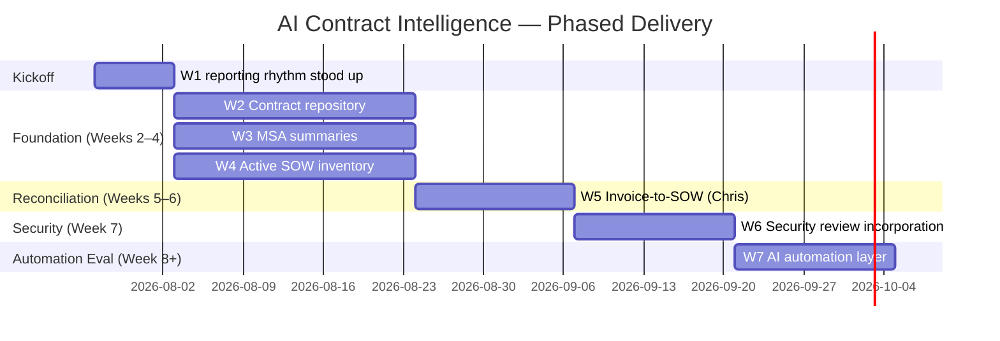

# AI Contract Intelligence Initiative
### Project Plan — v2 (Merged Executive + Operational)

**Owner:** Jason Yuhas, SVP Strategic Accounts  
**Executive Sponsors:** Jen Thomas (CSO) · Chris Jones (CFO)  
**Contributing:** Kate and Finance (as directed by Chris) — invoice/billing reconciliation phase  
**Initial summary due:** Friday, August 1, 2026  
**Cadence:** Weekly exec slide (Friday) to Executive Team + SLT  
**Last Updated:** July 29, 2026

---

## Purpose

This is not a cleanup project. It is a foundational capability for CipherHealth's AI RevOps maturity — a strategic asset that will serve **Sales, Finance, Legal, Customer Success, and Product**.

The end state is an **AI-powered contract intelligence repository**, not a document library.

**Downstream value:** strategic account planning, renewal management, pricing governance, expansion identification, customer insights, forecasting, and future AI automation.

**Guiding principle:** AI accelerates the work; all outputs are **trust, but verify**. The objective is strategic account planning — not legal interpretation.

---

## Strategic Initiative Linkage

This work establishes the baseline dataset that active strategic initiatives depend on:

| Strategic Initiative | What This Initiative Provides |
|---|---|
| **Product Naming** (Cipher → Evolve → Catalyst → Outreach / Rounding) | Ground-truth inventory of product names, modules, and packages actually contracted across 77 customers. Required before reconciling contracted names to the 2026 product hierarchy or migrating customers to new naming. |
| **Pricing & Packaging** | Complete view of contracted price, referenced future pricing, utilization commitments, and package composition across the customer base. The dataset the pricing & packaging strategic initiative needs to design future packages. |
| **GRR / Renewal Management** (secondary) | Renewal dates, notice windows, auto-renewal terms, and TFC provisions feed the 12-month rolling renewal calendar. Directly supports GRR recovery. |

---

## Sequencing Overview

| Phase | Timing | Workstreams | Gate to Proceed |
|---|---|---|---|
| **Kickoff** | Week of Jul 27 | W1 stood up, W2 begins | Reporting rhythm established |
| **Foundation** | Weeks 2–4 | W2, W3, W4 in parallel | Clean, trusted, searchable dataset complete |
| **Reconciliation** | Weeks 5–6 | W5 begins (Chris + Kate/Finance) | W2–W4 stable |
| **Security** | Week 7 | W6 — Kenny & Tyler informed | W5 complete |
| **Automation eval** | Week 8+ | W7 — cross-functional discussion | W6 complete |

> **Important:** Cross-functional automation discussions (W7) begin **after** the foundational data set is clean — not before. Establish a trusted dataset first, then automate from there.

---

## Workstreams

Each workstream is scoped so progress can be reported on a single exec slide.

---

### W1 — Weekly Cadence & Reporting Rhythm
**Owner:** Jason Yuhas | **Status:** Establishing this week

AI-generated weekly progress slide, delivered every **Friday** to Executive Team + SLT. Each slide is **standalone-readable** — anyone in SLT viewing a single week's slide should immediately understand what the initiative is, why it matters, current progress, and — critically — what the work is *surfacing* about business operations continuity risk and opportunity.

| Section | Content |
|---|---|
| Overall % complete | Progress against 77-contract denominator |
| Key accomplishments | 3–5 bullets |
| Risks surfaced | Business operations continuity risks discovered *through* the work |
| Opportunities identified | Continuity improvements the work is revealing |
| Blockers · decisions needed | Project-level, cross-functional |
| Remaining work + projected completion | Timeline to next phase gate |
| Strategic initiative progress | One line each on Product Naming and Pricing/Packaging baselines |

**Deliverable:** Recurring weekly exec slide (AI-automated draft after week 2 + human review before send). See [Weekly Exec Slide Template](#weekly-exec-slide-template-w1-output) below.

---

### W2 — Contract Repository (77 Contracts)
**Owner:** Jason Yuhas | **Status:** Kicking off

**Scope:** Every customer, organized by parent organization.

| Requirement | Detail |
|---|---|
| Centralization | All executed agreements in a single repository |
| Storage & naming | Establish and document long-term storage location and naming convention |
| Searchability | Every document searchable and AI-ready |
| Version control | Current executed versions clearly distinguished from superseded documents |

**Deliverables:**
- [ ] Central contract repository populated with all 77 executed agreements
- [ ] Parent-organization hierarchy documented
- [ ] Storage location and naming convention documented (runbook)
- [ ] Documents indexed for search and AI ingestion
- [ ] Version policy enforced: executed vs. redline vs. superseded

**Success criteria:** Any team member can locate any customer agreement by parent org, entity, or contract type within minutes.

---

### W3 — MSA Summaries
**Owner:** Jason Yuhas (AI-assisted via Cursor)

**Version control requirement:** AI must only read **current, executed versions** of MSAs — not documents passed during redlines, and not versions that have been replaced or updated. Draft, redline, and superseded documents must be flagged and excluded from AI ingestion.

Standardized summary per customer:

| Field | Purpose |
|---|---|
| MSA title | Identification |
| Parent organization and covered entities | Account hierarchy |
| MSA extends to child accounts / affiliates? | Flags expansion opportunities |
| Signature date and customer signer | Contract timeline and relationship context |
| Order of precedence | Conflict resolution across agreements |
| Contract term | Duration and obligations |
| Renewal date and renewal language | Renewal planning (including agreements that remain active while an SOW is active) |
| Notable commercial, legal, or operational provisions | Account strategy impact |
| Restrictions — logo usage, marketing, reference use | AI can scan and flag these |

**Objective:** Strategic account planning, not legal interpretation. Trust but verify.

**Deliverables:**
- [ ] Standardized MSA summary template
- [ ] Document version policy documented and enforced
- [ ] MSA summary for each customer (current versions only)
- [ ] Flagged items requiring Legal or Finance review
- [ ] Logo usage, marketing, and reference restrictions captured per account

**Success criteria:** Sales and CS can use MSA summaries for strategic account planning without opening source PDFs. No summaries derived from non-authoritative document versions.

---

### W4 — Active SOW Inventory
**Owner:** Jason Yuhas

Per active SOW:

| Field | Purpose |
|---|---|
| Product names / modules purchased | Entitlement clarity; Product Naming baseline |
| Programs, workflows, and use cases deployed | Deployment vs. contract alignment |
| Scripts / campaign details (where applicable) | Operational context |
| Contracted volumes and utilization commitments | Usage governance; Pricing & Packaging baseline |
| Contracted pricing | Pricing baseline |
| Referenced future pricing | Renewal / expansion forecasting |
| Go-live date | Timeline context |
| Termination-for-convenience provisions | Risk and renewal planning; GRR input |
| Auto-renewal terms and notice requirements | Renewal calendar inputs |
| **Non-standard amendments** | Exceptions or commercial changes via email or other side-channel means — **flag separately** |

**Deliverables:**
- [ ] Standardized SOW inventory template
- [ ] Active SOW record for each in-scope SOW
- [ ] Separate exception/amendment log for non-standard changes

**Success criteria:** Complete view of what is contracted and deployed for every active customer engagement.

---

### W5 — Invoice-to-SOW Reconciliation
**Owner:** Chris Peak | **Contributing:** Kate and Finance (as directed by Chris)  
**Sequenced:** After W2–W4 stable (Weeks 5–6)

Connect latest invoice detail to each active SOW so we have one view of **contracted vs. deployed vs. billed**. Cross-functional touchpoints with Finance.

| Dimension | Question Answered |
|---|---|
| **Contracted** | What did the customer agree to? |
| **Deployed** | What is live in production? |
| **Billed** | What is currently being invoiced? |

**Expected variance — not a failure condition:** Initial SOW records will not always match invoice detail. Common drivers include change orders, adds, and price increases executed after the original SOW. These variances are **outputs of the work** — they surface pricing governance gaps and billing exposure, not blockers to progress.

**Deliverables:**
- [ ] Invoice-to-SOW mapping for all active accounts
- [ ] Discrepancy report (contracted vs. deployed vs. billed)
- [ ] Change order / add / price increase log linked to variance items
- [ ] Integrated account view in the contract intelligence repository

**Success criteria:** Single source of truth linking contract terms, deployment status, and billing — with documented explanation for known variances.

---

### W6 — Security Review Incorporation
**Owner:** Jason Yuhas (coordination) | **Stakeholders:** Kenny and Tyler (to be informed)  
**Sequenced:** After W5 complete (Week 7)

Incorporate findings from the last security review into the contract intelligence repository. Dated or expired security assessments create measurable business risk:

| Risk Area | Impact |
|---|---|
| **Open opportunities** | Security posture gaps can stall or derail active deals |
| **Revenue attainment** | Assessment currency affects close rates and expansion timing |
| **Customer churn** | Outdated assessments erode trust and increase retention risk |

**Deliverables:**
- [ ] Security assessment status linked to each customer account
- [ ] Assessment currency tracked (last review date, expiration, renewal due)
- [ ] Kenny and Tyler briefed on integration approach and ongoing visibility
- [ ] Alerts for accounts with dated/expired security assessments
- [ ] Cross-reference between security status and renewal / expansion pipeline

**Success criteria:** Sales, CS, and Security have shared visibility into assessment currency alongside contract data.

---

### W7 — AI Automation Layer (Future Phase)
**Owner:** Jason Yuhas | **Sequenced:** After W6 complete (Week 8+)

Evaluate where AI automation adds value — renewal notifications, workflow orchestration, rolling 12-month renewal calendar. Cross-functional teams (CS, Finance, Legal, Product) engaged **after** foundational work, not before.

| Automation Area | Description |
|---|---|
| **Renewal management** | Rolling 12-month renewal calendar |
| **Notifications** | Proactive alerts for renewal windows, notice periods, and term expirations |
| **Workflow orchestration** | Cross-team handoffs for renewal prep, Legal review, and Finance alignment |

**Deliverables:**
- [ ] Automation opportunity assessment (prioritized)
- [ ] Rolling 12-month renewal calendar (initial version)
- [ ] Recommended automation roadmap with owners
- [ ] Cross-functional working session outcomes

**Success criteria:** Leadership-approved automation roadmap with clear ROI and ownership.

---

## Weekly Exec Slide Template (W1 Output)

One page. Standalone-readable — an SLT member viewing any single week should understand the project, its purpose, current state, and what it is surfacing.

**Structure:**

**Header:** Week of [date] · AI Contract Intelligence Initiative

**Project & Why** (2 lines, appears every week)
- *What:* Building an AI-powered contract intelligence repository across our 77 executed customer agreements.
- *Why:* Foundational to strategic account planning, renewal governance, pricing baseline, and the product naming and pricing/packaging strategic initiatives.

**Overall % Complete** — progress bar, 77-contract denominator

**Key Accomplishments** — 3–5 bullets

**Risks Surfaced — Business Operations Continuity**  
Risks discovered *through* the work this week — distinct from project blockers.  
Examples: unclear renewal language, missed TFC clauses, non-standard amendments creating billing exposure, orphaned SOWs, undocumented pricing exceptions, marketing/logo restrictions we've been violating, auto-renewal notice windows already inside the trigger date, dated security assessments on active accounts.

**Opportunities Identified — Continuity of Business Operations**  
Improvements the work is revealing.  
Examples: renewal automation candidates, package standardization opportunities, pricing governance gaps, expansion signals from MSA affiliate clauses, cross-sell whitespace visible from contracted-vs-deployed comparison.

**Blockers · Decisions Needed** — project-level, cross-functional

**Remaining Work + Projected Completion**

**Strategic Initiative Progress** — one line each on Product Naming baseline and Pricing / Packaging baseline

> By week 4, the *Risks Surfaced* and *Opportunities Identified* sections become the compounding operational value of the initiative — not just status, but business intelligence.

---

## Guardrails

| Guardrail | Detail |
|---|---|
| **HIPAA** | Contract metadata only — no PHI in AI prompts or outputs |
| **Trust but verify** | AI accelerates the work; humans validate. All outputs are drafts until reviewed |
| **Gaps are the point** | We expect them. Gaps identify blind spots — they are outputs of the work, not blockers to it |
| **Version integrity** | AI ingests executed agreements only — never redlines or superseded versions |
| **SOW-invoice variance** | Mismatch between SOW and invoice is expected initially; document change orders, adds, and price increases rather than forcing false alignment |

---

## Stakeholders & Roles

| Role | Name | Responsibility |
|---|---|---|
| **Owner** | Jason Yuhas | Overall delivery, W1–W4, W6–W7 coordination |
| **Executive Sponsor** | Jen Thomas (CSO) | Priority setting, cross-functional escalation |
| **Executive Sponsor** | Chris Jones (CFO) | Finance alignment, W5 sponsorship |
| **Billing Reconciliation** | Chris Peak | W5 — invoice-to-SOW linkage |
| **Finance Support** | Kate + Finance team | W5 — as directed by Chris |
| **Security Review** | Kenny, Tyler | W6 — assessment incorporation and ongoing governance |
| **SLT / Executive Team** | — | Weekly slide visibility (Fridays) |
| **Sales, Finance, Legal, CS, Product** | — | W7 cross-functional input; trust-but-verify on outputs |

---

## Risks & Mitigations

| Risk | Impact | Mitigation |
|---|---|---|
| Incomplete or missing contracts | Gaps in repository | Audit against CRM/account list; escalate missing docs to Legal |
| AI reads wrong document version (redlines, superseded) | Incorrect summaries | Enforce version policy; exclude non-executed docs from AI ingestion |
| AI extraction errors | Incorrect summaries | Trust-but-verify workflow; Legal/Finance review for flagged items |
| Non-standard amendments overlooked | Commercial surprises | Dedicated exception log; separate flagging in SOW inventory |
| SOW-invoice mismatch treated as failure | False confidence or stalled progress | Document variances; log change orders, adds, price increases |
| Scope creep into automation before data is clean | Rework, low trust | Enforce foundation gate before W7 cross-functional sessions |
| Dated security assessments | Open opp risk, rev attainment impact, churn | W6 integration; proactive alerts for expired assessments |
| Resource constraints | Timeline slip | AI acceleration for extraction; clear prioritization of 77 contracts |

---

## Key Decisions & Open Questions

| Decision / Question | Owner | Timing |
|---|---|---|
| Final choice of repository location and naming convention | Jason + IT/Legal | W2 kickoff |
| Document version policy (executed vs. redline vs. superseded) | Jason + Legal | W2 kickoff |
| Cursor/AI tooling setup and access for Jason's team | Jason + IT | Kickoff |
| MSA/SOW summary template approval | Jason + Legal | Before bulk extraction |
| Definition of "active" for SOW inventory — treatment of expired-but-still-invoicing agreements | Jason + Legal + Finance | W4 kickoff |
| Exception/amendment handling process | Jason + Legal | W4 |
| Cadence handoff point for W5 (Chris) — trigger criteria for start | Jason + Chris | End of W4 |
| Invoice data source and mapping rules | Chris + Kate + Finance | W5 kickoff |
| Security assessment data source and alert thresholds | Kenny + Tyler + Jason | W6 kickoff |
| Automation priority ranking | Leadership + Jason | W7 kickoff |

---

## Definition of Done — Initiative Complete

The initiative is complete when:

1. All 77 contracts are centralized, searchable, and AI-ready (current executed versions only)
2. Every customer has a verified MSA summary — including logo, marketing, and reference restrictions
3. Every active SOW has a complete inventory record with exceptions flagged separately
4. Weekly AI-assisted exec slide is operational and delivering business intelligence (not just status)
5. Invoice details are linked to active SOWs with documented variance explanations (contracted, deployed, billed)
6. Security assessment currency is integrated and visible per account (Kenny & Tyler informed)
7. A rolling 12-month renewal calendar and automation roadmap are approved (W7)
8. Product Naming and Pricing/Packaging strategic initiatives have a trusted baseline dataset
9. The repository functions as an **AI-powered contract intelligence platform** — not a passive document library

---

## Appendix — Document Templates (To Be Created)

- [ ] Contract naming convention runbook
- [ ] Document version control policy (executed vs. redline vs. superseded)
- [ ] MSA summary template
- [ ] Active SOW inventory template
- [ ] Non-standard amendment / exception log
- [ ] Change order / add / price increase variance log
- [ ] Weekly exec slide template
- [ ] Renewal calendar template
- [ ] Security assessment status tracker

---

*v2 — Merged executive and operational plan. Living document; refined weekly as workstreams progress.*
